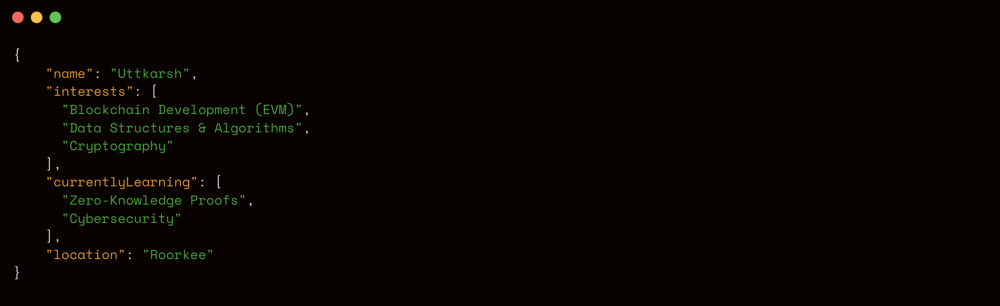

  

<h1 align = "center"> 
👋 Hey, I'm Uttkarsh.
</h1>

<b>I write code, chase bugs, and occasionally find meaning in the chaos.</b>

## 💻 Technologies I use
                  

## 🌐 Socials
   

**P.S.:**  Running on just enough coffee to fake stability.
